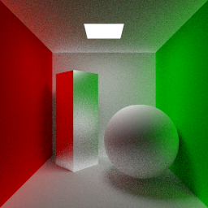
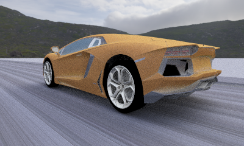

## Introduction
A CPU pathtracer only for triangle mesh.

## Dependencies
* stb_image
* rgbe

## Feature
* vec math
* load obj, mtl
* Monte Carlo Path Tracing
* BVH
* SSE accelerate
* OpenMP
* hdr environment map sample
* importance sample(blinn-sample)
* texture
* hdr important sample

## result
1. cornellbox

2. car

## reference
* games101
* https://blog.csdn.net/weixin_44176696/article/details/119988866

